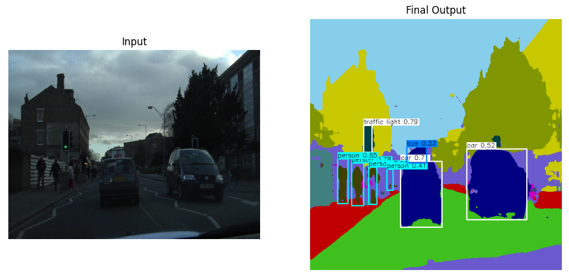

# RoadVision 
<p align="center">
  
</p>
**Semantic Segmentation + Object Detection for Intelligent Road Scene Understanding**

RoadVision is a deep learning web application that fuses **semantic segmentation** (U‑Net) with **object detection** (YOLO) to analyze road scenes. It outputs an RGB segmentation mask with color‑coded classes and overlays YOLO bounding boxes—ideal for autonomous driving demos, smart‑city prototypes, and research.

---

##  Features

- 🔍 **Object Detection**: YOLOv8 pretrained on COCO  
- 🌈 **Semantic Segmentation**: Custom U‑Net 
- 🎯 **Combined Loss**: Focal Loss + Dice Loss for robust class learning  
- ⚙️ **Training Regimen**: Adam optimizer + StepLR scheduler, 30 epochs  
- 📈 **Metrics**:  
  - Final training loss: **1.2**  
  - Final validation loss: **2.1**  
  - Pixel accuracy: **85 %**  
- 🖼️ **Inference Pipeline**:  
  1. Pass input through U‑Net → segmentation mask  
  2. Pass input through YOLO → bounding boxes  
  3. Color‑code each mask class (e.g., road=green, sidewalk=red, building=yellow, car=blue)  
  4. Overlay YOLO boxes on the colored mask  
- 📱 **Streamlit UI**: File upload or webcam input  
- ☁️ **Deployable** on Hugging Face Spaces (CPU only)

---

## Installation

1. **Clone the repository**
   ```bash
   git clone https://github.com/vaibhav34777/RoadVision.git
   cd roadvision
2. **Install Dependencies**
   ```bash
   pip install -r requirements.txt
3. **Load the model**
   load weights in the unet model from outputs/README.md and load the pretrained YOLO model from ultralytics.
4. **Streamlit app**
   ```bash
   streamlit run app.py

## UNet Architecture
I implement a standard encoder–decoder U‑Net with skip connections , there is total of 5 blocks in both encoder and decoder, and each block has 2 convolution layers and i have used a 2x2 max pooling after each block in encoder and used transpose convolution for uplifting the spatial dimensions of the activations in the decoder .
The model has approximately 7.5 million parameters , I have used 32 output classes so the output segmentation mask has values from 0 -31 but i have reduced the number of active classes by merging classes and ignoring some classes for better performance with a smaller dataset.

## Loss Function
To handle class imbalance and encourage precise boundaries, i use a combination of Focal Loss and Dice Loss for optimization.
I have used 0.4*Focal loss + 0.6*Dice Loss for focusing on both the focal and dice loss.
This forces the network to focus on hard pixels and maximizes overlap with the ground truth.

## Training
- Optimizer: Adam (lr=1e‑3)

- Scheduler: StepLR(step_size=10, gamma=0.1)

- Epochs: 30

Results:

- Training loss ↓ to 1.2

- Validation loss ↓ to 2.1

- Pixel accuracy ↑ to 85 %

## Inference
1. Preprocess: resize & normalize input image

2. Segmentation → mask = unet(img_tensor).argmax(dim=0)

3. Color map → colored_mask = apply_colormap(mask)

4. Detection → detections = yolo(img)

5. Overlay → output = draw_boxes(colored_mask, detections)

## Demo Video
Watch a quick demo of RoadVision in action across the whole validation set:
[Demo Video](https://drive.google.com/file/d/1sQh1VaNRaLaKlDfIu0NxfodgiU2xoI9h/view?usp=drive_link)

## Kaggle Notebook
Explore the training pipeline, data preprocessing, and metric analysis in my interactive Kaggle notebook:
[kaggle Notebook](https://www.kaggle.com/code/vaibhav1908/roadvision)

## Deployment on Hugging Face Spaces
1. Push your repository to a new HF Space (choose “Streamlit”).

2. Ensure app.py, requirements.txt, and models/ are present.

3. Hugging Face will auto‑deploy your app.
   [HuggingFace Space](https://huggingface.co/spaces/imvaibhavrana/RoadVision)

## Acknowledgement
**Hugging Face Spaces** for providing a free and easy-to-use hosting platform for Streamlit applications, enabling seamless deployment and sharing of RoadVision.  
- **YOLOv8** (You Only Look Once) for the pretrained object detection model weights and codebase, which form the backbone of our detection pipeline.  

## License
This project is MIT‑licensed. If you use RoadVision in your research or applications, please cite.
